# Green Company Sales Optimization

### Introduction
---
> Linear programming was first used by Leonid Kantorovich to develop a mathematical model to reduce the cost of armies expenses. Nowadays, linear programming 
> is used in a wide branch of industries, such as trasnportation, energy and manufacture; to make processes more efficient and cost efective. Green Company is 
> a seudonym for the world's largest oilfield services company with presence in more than 85 countries in the world. 

### Problem
---
> Green Company has asked us to maximize the sales of certain drill BITS of the company for the second quarter of 2019, taking into account: 
  * Sales forecast made on the first quarter of 2019
  

  
Forecast

  
  | **BIT Type** | **Revenue Incremental Goal/Q(%)** | **Driver**                                                                                                           |
  |:------------:|:---------------------------------:|----------------------------------------------------------------------------------------------------------------------|
  |    PDC NT    |                12%                | Focused on best-selling products after analysis and  with higher price to adress new technology                      |
  |     PDC R    |                 8%                | Focused on best-selling products after  analysis, with a expected trend increase base on forecasted activity increase |
  |      RT      |                 3%                | Set as commodity for the rest of the products                                                                        |
  |      RI      |                 1%                | Set as commodity for the rest of the products                                                                        |
  
  

  
  

  
Definition of variables

  
 | **BIT Type** |         **Definition**        |
  |:------------:|:-----------------------------:|
  |      PDC     | Polycristaline Diamod Compact |
  |    PDC NT    |       PDC New Technology      |
  |     PDC R    |        PDC Regular Tech       |
  |      RT      |          Roller Tooth         |
  |      RI      |         Roller Insert         |                                                                       
  

  
  * The available inventory of drill BITS for the second quarter of 2019
  

  
Available Inventory

  
  | **BIT Type** | **Size** | **Inventory Q2-2019** |
  |:------------:|:--------:|:---------------------:|
  |    PDC NT    |   16 ''  |           1           |
  |              |  12.25'' |           10          |
  |              |   8.5''  |           8           |
  |     PDC R    |   16''   |           8           |
  |              | 12 1/4'' |           10          |
  |              | 8 1/2 '' |           8           |
  |              | 6.125 '' |           8           |
  |      RI      |   26''   |           5           |
  |              |   16''   |           1           |
  |      RT      |   26''   |           1           |
  |              |   16''   |           6           |
  |              | 12 1/4'' |           2           |
  |              |   8.5''  |           2           |
  |              |  6.125'' |           6           |
  

  * Mantain or increase the profit level after the optimization

### Data
---
> For the optimization problem, we gathered data for each BIT Type sales from january-2019 to march-2019. 

> Sales period January-2019
<kbd>
  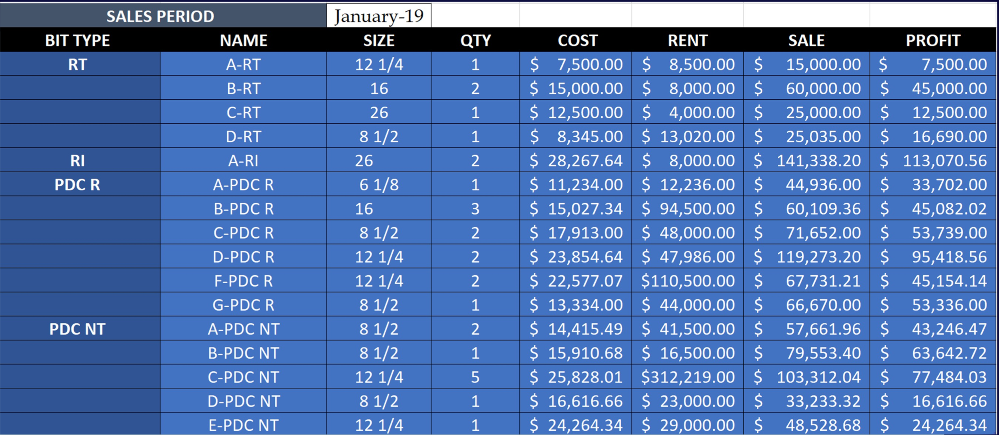
</kbd>

> Sales period February-2019
<kbd>
  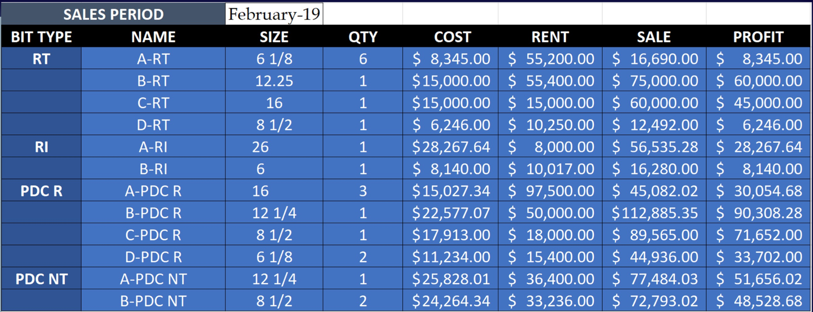
</kbd>

> Sales period March-2019
<kbd>
  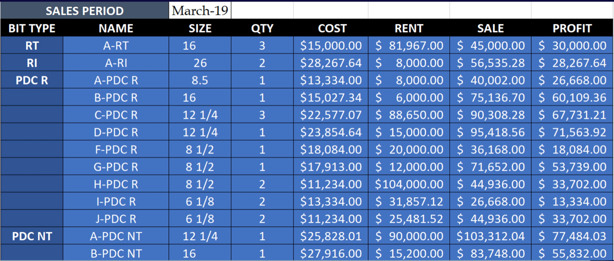
</kbd>

### Development
---
> With the data and the forecast constraints we developed the objective function and maximize it with _Solver_ in Excel. 

> PDC NT maximization problem
<kbd>
  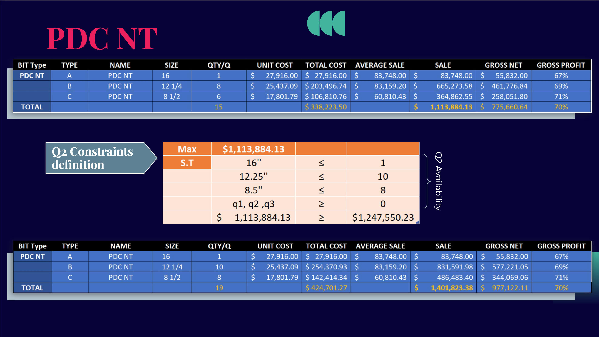
</kbd>

> PDC R maximization problem
<kbd>
  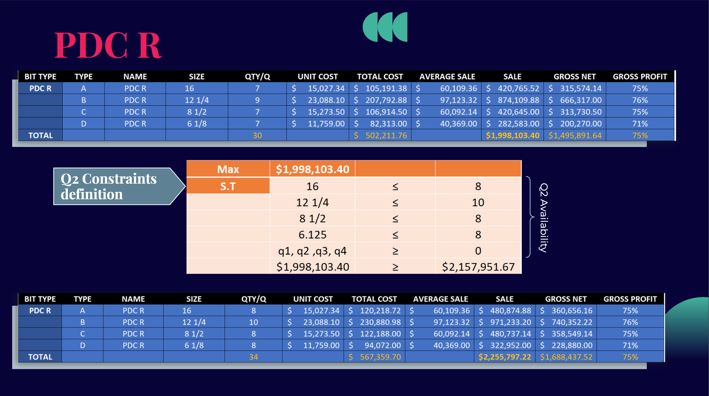
</kbd>

> RT maximization problem
<kbd>
  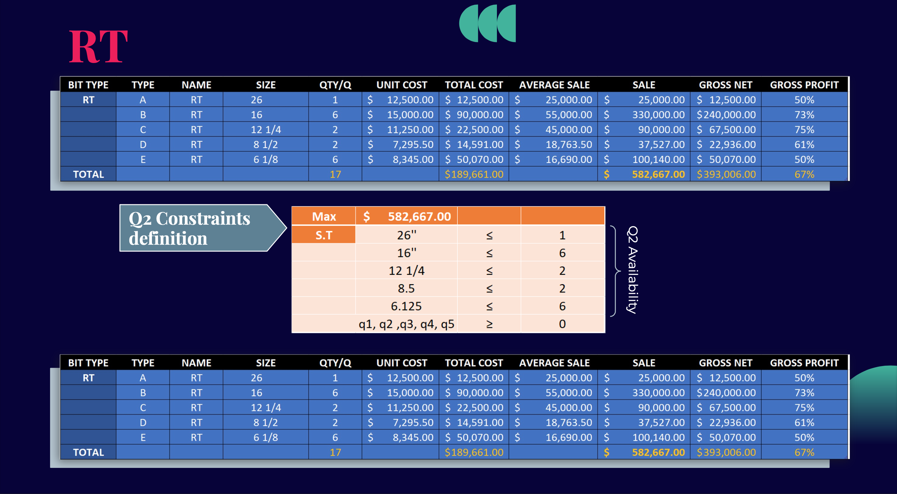
</kbd>

> RI maximization problem
<kbd>
  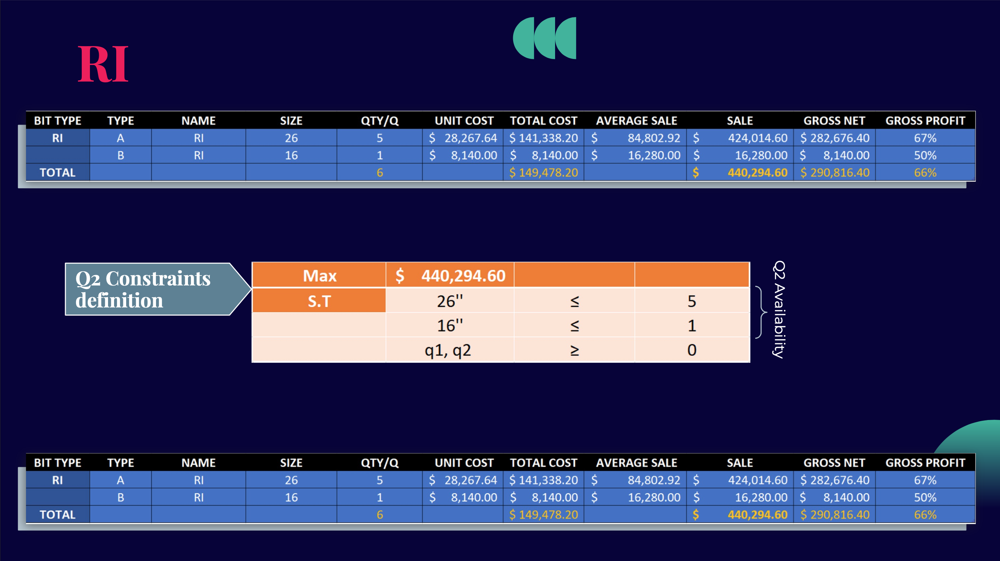
</kbd>

### Results per BIT Type
---
> Once the linear model was optimized, we analyzed the result for each BIT type

> PDC NT Results
* Sales increased 20.5%
* Groos Net increased 20.6%
* Profit increase 0.01%

<kbd>
  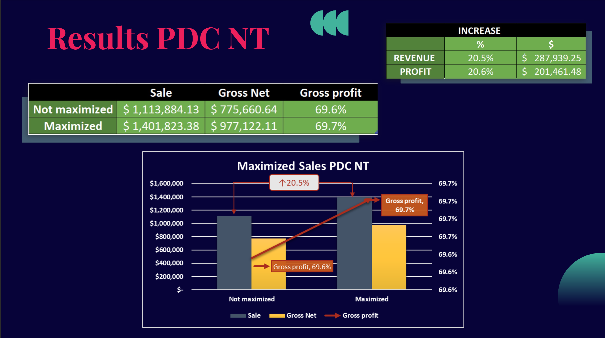
</kbd>

> PDC R Results
* Sales increased 11.4%
* Gross Net increased 11.4%
* Profit increased 0.01%

<kbd>
  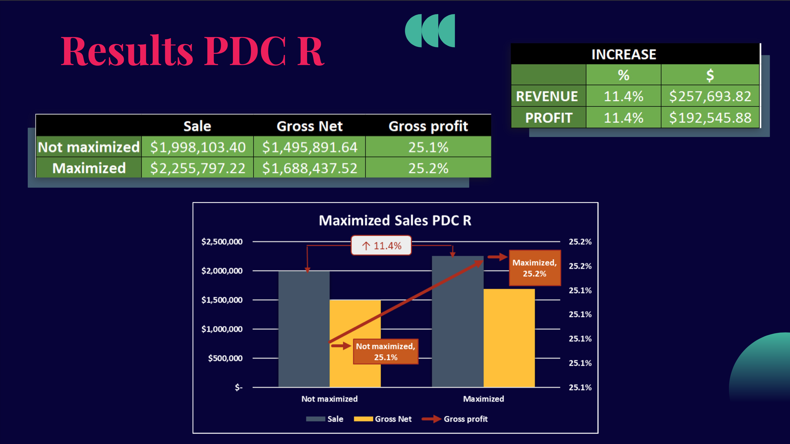
</kbd>

> RT Result
* Sales, gross net and profit mantained at the same level fulfilling the company's objective

<kbd>
  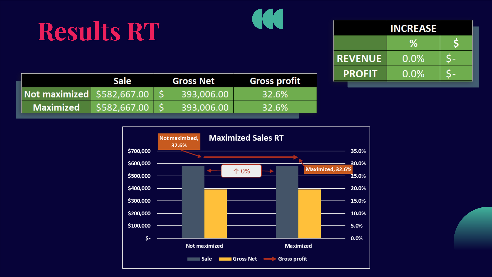
</kbd>

> RI Result
* Sales, gross net and profit mantained at the same level fulfilling the company's objective

<kbd>
  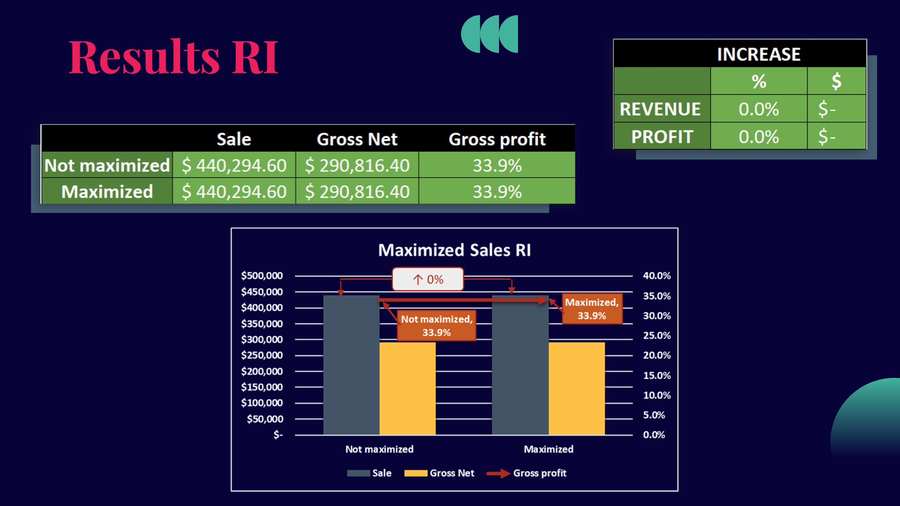
</kbd>

### Global Results
---

> Once we analyzed the result for each BIT type, we made graphs and calculate percentages to observe the global result of the maximization problem. 

> Sales and Gross Net final results

<kbd>
  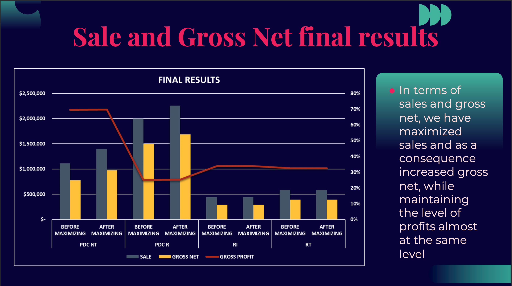
</kbd>

> Quantities final sales

<kbd>
  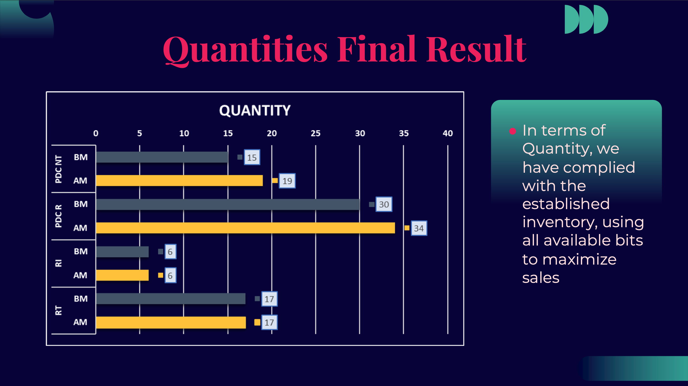
</kbd>

> Final results 

<kbd>
  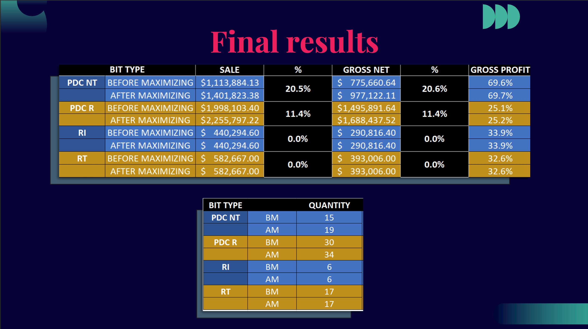
</kbd>

### Conclusion
---
> With the help of _Solver_ in Excel we maximized Green Company sales subject to the forecast constraints and the company available inventory, increasing 
> sales by 11.7% and gross net by 11.8%. This proves how linear programming can be usefull for improving companies sales, process and cost.

> Sales and Gross Net final results

<kbd>
  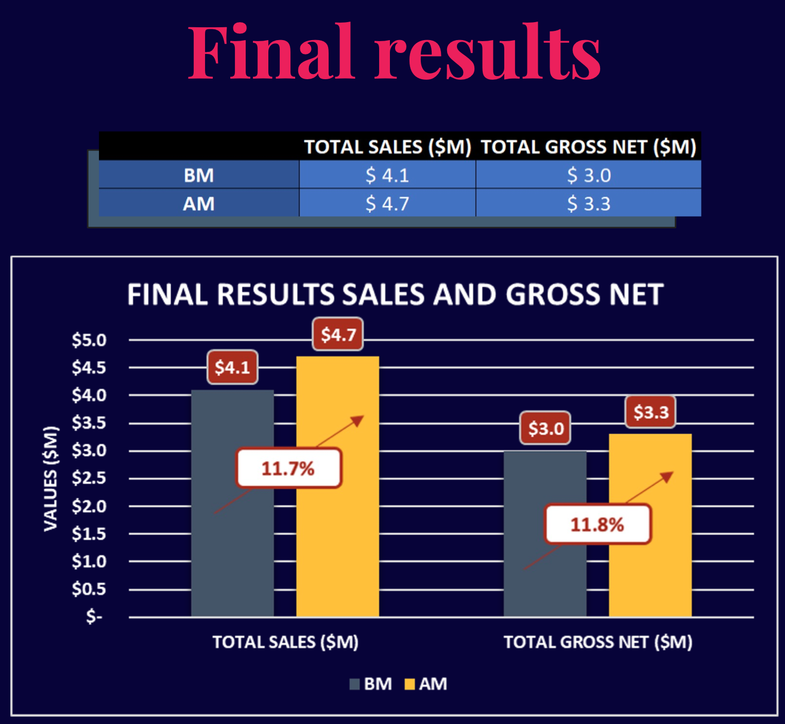
</kbd>

<kbd>
  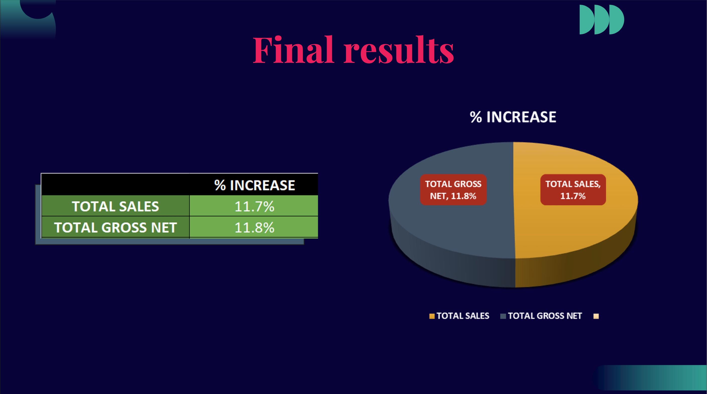
</kbd>

### Recomendations
---
> Taking into account the results from the maximization problem, we will recommend the company:
* Increase the available inventory
  * By increasing the available inventory, Green Company could increase their sales and generate a higher profit
* Innovate RT and RI
  * RT and RI are BIT's that are _old_ in term of technology. For this reason, Gree Company is not interested in increasing its sales but maintaining them. 
  * A better solution will be to innovate and adapt them to the _new_ technology which could improve the performace and efficiency of the BIT at drilling. This improvement
  * could increase the demand of the BIT on the market at thus increase Green Company sales
* Focus on PDC NT
  * Since new technology is always more efficient than old, Green Company should focus on PDC NT to increase its demand in the market, but without leaving aside
  * PDC R that even thought is regular technology, it is the most demanded BIT on the market.

